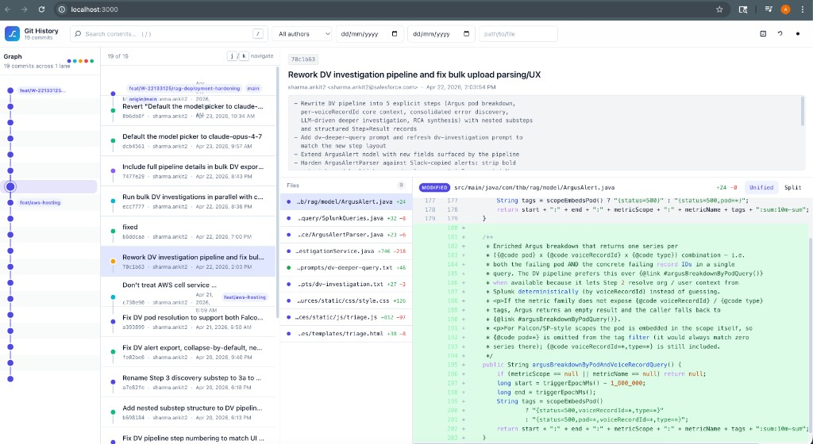

# Git History UI

[](https://badge.fury.io/js/git-history-ui)
[](https://www.npmjs.com/package/git-history-ui)
[](https://www.npmjs.com/package/git-history-ui)
[](https://bundlephobia.com/result?p=git-history-ui)
[](https://github.com/beingmartinbmc/git-history-ui)
[](https://github.com/beingmartinbmc/git-history-ui/issues)

A fast, zero-setup web UI to explore your git history visually. Run it in any
repo and inspect branches, commits, and diffs interactively in your browser.

## 👀 Preview



## 🚀 Quick Start

```bash
# Go to the git repository you want to inspect
cd /path/to/your/project

# Run directly with npx (no installation needed)
npx git-history-ui@latest
```

That's it! The application will start on `http://localhost:3000` and open your browser automatically.
It reads history from the current working directory, so run it inside the project whose commits you want to visualize.

No installs. No config. Just your commits, visualized.

## 🤔 Why use this?

- `git log` is powerful, but hard to scan when branches, merges, and long-lived work overlap.
- GitHub's commit UI does not show your local or unpushed commits.
- Desktop clients can be heavy when you just want a quick read on one repo.
- `git-history-ui` gives you a fast, local, visual way to explore history from any git repository.

## ✨ Features

- **Canvas-based commit graph** - Branch lanes, hover states, selected commits, and branch/tag pills.
- **Real-time filtering** - Filter by author, date range, commit text, or file path.
- **Diff-first commit review** - Move from graph to commit list to unified or split diffs without leaving the browser.
- **Local by default** - Runs against the repo on your machine, including unpushed commits.
- **Dark/light/system mode** - Toggle manually or follow your OS preference.
- **Zero setup** - Unlike GitKraken or SourceTree, it runs instantly with `npx`.

## ⚖️ How it compares

- **vs GitHub UI**: shows local branches and unpushed commits because it runs inside your repository.
- **vs `tig` or `git log`**: gives you visual lanes, filters, and browser-based diffs instead of a terminal-only view.
- **vs desktop Git clients**: starts on demand with no workspace setup, account login, or project import.

## 📖 Usage

### CLI Options

Run these commands from inside the git repository you want to inspect.

```bash
# Custom port
npx git-history-ui@latest --port 8080

# Filter by specific file
npx git-history-ui@latest --file src/app.js

# Filter by author
npx git-history-ui@latest --author "your-name"

# Filter by date range
npx git-history-ui@latest --since 2024-01-01

# Don't auto-open browser
npx git-history-ui@latest --no-open

# Show help
npx git-history-ui@latest --help
```

## 🏭 Production

### Build for Production
```bash
# Build both backend and frontend
npm run build:production

# Start production server
npm run start:production
```

### Docker
```bash
# Build and run with Docker
docker build -t git-history-ui .
docker run -p 3000:3000 git-history-ui
```

## 🛠️ Development

### Setup
```bash
# Clone and install
git clone https://github.com/beingmartinbmc/git-history-ui.git
cd git-history-ui
npm install

# Start development servers
npm run dev
```

### Testing
```bash
# Run backend tests
npm test

# Run frontend tests
cd frontend && npm test
```

## 📋 Requirements

- **Node.js**: 20.19.0 or higher, or 22.12.0 or higher
- **Git**: Any version (must be in a git repository)

## 🤝 Contributing

1. Fork the repository
2. Create a feature branch
3. Make your changes
4. Run tests
5. Submit a pull request

## 📄 License

MIT License - see [LICENSE](LICENSE) file for details

---

Made with ❤️ for developers who love beautiful git visualizations
